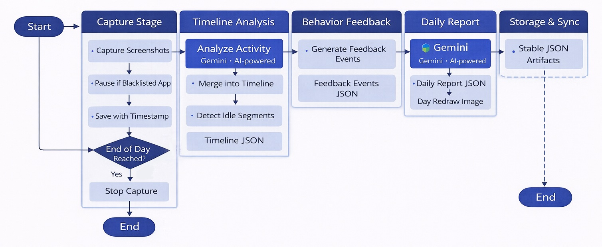

# 🧩 Mosaic — Piece together your life

<p align="center">
  <b>An AI-assisted daily life recap system that captures context, protects privacy, builds a timeline, and generates a reflective daily report.</b>
</p>

<p align="center">
  
  
  
  
  
  
</p>

---

## ✨ What Mosaic does

Mosaic helps you **capture and reconstruct your day** from lightweight desktop screenshots and context signals, then turns that data into:

- a **readable timeline** of your day
- **feedback events** (gentle nudges / observations)
- an optional **Google Calendar + Tasks (today)** snapshot
- a **daily report JSON**
- a **“redraw of the day”** AI-generated image

It is designed as a **local-first prototype** with a **FastAPI backend + browser UI**, so future desktop/mobile clients can read stable JSON artifacts.

---

## 🖼️ Visual Preview (Sample Output)

> Example “Redraw of the Day” image included in the repo (`examples/`)

<p align="center">
  
</p>

---

## 🧠 Core Features

### 1) Desktop capture with privacy pause
- Periodic screenshot capture
- Auto-pause when blacklisted apps / window titles / URL keywords are detected
- Resume automatically when sensitive content is gone

### 2) AI timeline generation
- Converts screenshots into labeled time segments
- Produces both machine-readable segments and human-readable summaries
- Includes best-effort idle detection and segment smoothing

### 3) Daily reflection artifacts
- Feedback events (lightweight behavioral prompts)
- Daily recap JSON
- Optional “redraw of the day” image generation

### 4) Google Today integration (optional)
- OAuth-based Google login in local web app
- Reads **today’s Calendar events** and **Tasks due today**
- Stores exported snapshot as artifact JSON

### 5) Local web dashboard
- View timeline / segments / feedback
- Trigger builds (with / without redraw)
- Start / stop capture
- Manage privacy config
- Connect / disconnect Google

---

## 🏗️ System Architecture

<p align="center">
  
</p>

---

## 📁 Repository Structure (current)

```text
Mosaic-Piece-together-your-life/
├─ artified_backend/          # main backend (pipelines, services, API server, CLI)
│  ├─ pipelines/              # timeline / trigger / google export / daily report
│  ├─ services/               # screenshot capture, app monitor
│  ├─ tools/                  # simulation helpers
│  ├─ main.py                 # CLI: run / simulate-day / build-all
│  ├─ serve.py                # FastAPI app + local web endpoints
│  └─ config.py               # unified runtime/config defaults
├─ web/                       # local browser UI (index.html + app.js + styles.css)
├─ examples/                  # sample outputs (timeline/report/google/redraw)
├─ test_functions/            # functional test scripts for modules/pipelines
├─ run_mosaic.py              # convenience launcher (starts local server + opens browser)
├─ main_mac.py                # older/alternate macOS-side prototype entry
├─ requirements.txt
└─ Dockerfile
```

---

## 🚀 Quick Start (Recommended)

### 1) Create environment & install dependencies

```bash
python -m venv .venv
# Windows
.venv\Scripts\activate
# macOS / Linux
source .venv/bin/activate

pip install -r requirements.txt
```

### 2) Set Gemini API key

**Windows PowerShell**

```powershell
$env:GEMINI_API_KEY="YOUR_KEY"
```

**macOS / Linux**

```bash
export GEMINI_API_KEY="YOUR_KEY"
```

### 3) Launch local web app (recommended)

```bash
python run_mosaic.py
```

This starts the local FastAPI server and opens the browser UI (default: `http://127.0.0.1:8000`).

---

## 🖥️ Alternative Launch Methods

### A) Run API server directly (dev mode)

```bash
uvicorn artified_backend.serve:app --host 127.0.0.1 --port 8000 --reload
```

### B) Use backend CLI pipeline directly

The backend CLI supports:

* `run` (real capture until stop time, then build artifacts)
* `simulate-day` (generate fake day folder for testing)
* `build-all` (build artifacts for an existing day folder)

Examples:

```bash
# real capture (interval in seconds)
python -m artified_backend.main run --interval 60 --stop 23:00
```

```bash
# simulate a day from existing screenshots
python -m artified_backend.main simulate-day --source screenshots --outroot screenshots_test --seed 42
```

```bash
# build artifacts for an existing day directory
python -m artified_backend.main build-all --daydir screenshots_test/2026/January/31 --date 2026-01-31
```

---

## 🗂️ Output Layout (Artifacts)

Mosaic writes screenshots into day folders and stores build results under `artifacts/`.

```text
<DATA_DIR>/screenshots/YYYY/Month/DD/
├─ HH-MM-SS.png
├─ ...
├─ session_log.jsonl
└─ artifacts/
   ├─ timeline_YYYY-MM-DD.json
   ├─ feedback_events_YYYY-MM-DD.json
   ├─ google_today_YYYY-MM-DD.json        # optional
   ├─ daily_report_YYYY-MM-DD.json
   └─ redraw_YYYY-MM-DD_<style>.png|jpg
```

---

## ⚙️ Configuration Highlights

Main config lives in:

```text
artified_backend/config.py
```

Important defaults include:

* timezone (`America/Los_Angeles`)
* screenshot interval / stop time
* unified data directory + screenshot root
* privacy config path
* Gemini text/image model names
* timeline preprocessing + quota controls
* idle detection thresholds
* Google credentials/token paths

### Privacy config (preferred web-UI format)

```json
{
  "blocked_apps": ["WeChat", "Messages"],
  "blocked_keywords": ["bank", "password", "confidential"]
}
```

The config loader also supports older blacklist formats for backward compatibility.

---

## 🌐 Local Web API (selected endpoints)

### Health / browsing

* `GET /api/health`
* `GET /api/latest`
* `GET /api/days`

### Day artifacts

* `GET /api/day/{yyyy}-{mm}-{dd}/timeline`
* `GET /api/day/{yyyy}-{mm}-{dd}/feedback`
* `GET /api/day/{yyyy}-{mm}-{dd}/report`
* `GET /api/day/{yyyy}-{mm}-{dd}/redraw`
* `GET /api/day/{yyyy}-{mm}-{dd}/screenshots`

### Capture controls

* `GET /api/capture/status`
* `POST /api/capture/start`
* `POST /api/capture/stop`
* `POST /api/capture/pause`

### Build triggers

* `POST /api/build` (latest day, no redraw)
* `POST /api/build/today` (full build, with redraw)
* `POST /api/build/latest` (full build, latest day)

### Privacy config

* `GET /api/privacy/config`
* `POST /api/privacy/config`

### Google integration

* `GET /api/auth/google/status`
* `GET /api/auth/google/start`
* `GET /api/auth/google/callback`
* `POST /api/auth/google/disconnect`
* `GET /api/google/today`

---

## 🔐 Google Calendar / Tasks Setup (Optional)

To enable Google integration in the web UI:

1. Create OAuth client credentials in Google Cloud Console
2. Place the client secret JSON where the app expects it (commonly `credentials.json`)
3. Start the app and click **Connect Google**
4. Complete OAuth in browser
5. A token file will be stored locally and reused for later exports / reads

Scopes used are read-only for:

* Calendar
* Tasks

---

## 🐳 Docker (API / UI only note)

A Dockerfile is included and runs:

```bash
uvicorn artified_backend.serve:app --host 0.0.0.0 --port 8000
```

> ⚠️ Note: desktop screenshot capture is OS-specific (especially macOS permissions / APIs), so containerized Linux runs are best for API/UI development and artifact browsing rather than full desktop capture.

---

## 🧪 Example Outputs Included

The `examples/` folder contains sample artifacts you can inspect without running a full day:

* timeline JSON
* Google today JSON
* daily report JSON
* redraw image
* template JSON

This makes it easier to build UI or debug downstream consumers first.

---

## 🛠️ Troubleshooting

### macOS screenshot permissions

If capture fails on macOS, check:

* **Screen Recording permission**
* **Accessibility permission** (if required by window/app detection tools)

### Google auth errors

* Ensure `credentials.json` exists
* Verify redirect URI matches the one configured in the app
* Delete local token and reconnect if scopes changed

### Gemini JSON parse issues

If model output is malformed:

* tighten prompts
* reduce temperature
* retry build on the same day folder

---

## 📌 Project Status

This repo is an evolving prototype with multiple generations of code:

* **`artified_backend/` + `web/`** → current integrated stack (recommended)
* top-level `services/` / `main_mac.py` → earlier experimentation / platform-specific prototype components

---

## 🤝 Contributing

PRs are welcome, especially for:

* UI polish / data visualization improvements
* pipeline robustness
* privacy detection improvements
* schema documentation
* export integrations (Notion / Obsidian / etc.)

---

## 📄 License

No license is currently specified in this repository.
If you plan to open-source contributions broadly, consider adding a license file (MIT / Apache-2.0 / GPL, etc.).

---

